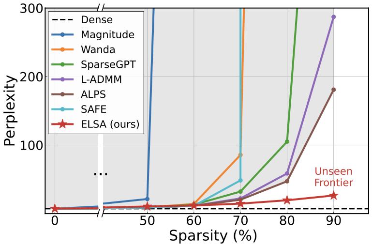
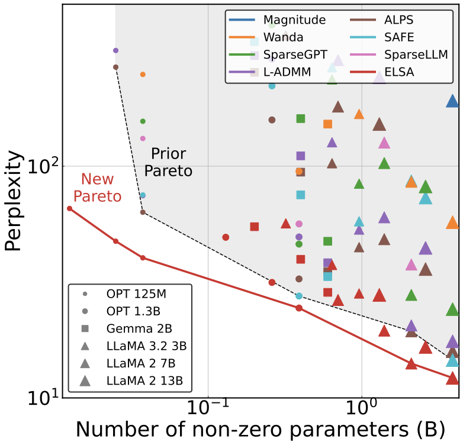

# ❄️👸🏼 ELSA: Extreme LLM Sparsity via surrogate-free ADMM

Official codebase for:

**The Unseen Frontier: Pushing the Limits of LLM Sparsity with Surrogate-Free ADMM ([ICLR '26](https://openreview.net/forum?id=ek6dQSumYx))**  
***Kwanhee Lee**, Hyeondo Jang, Dongyeop Lee, Dan Alistarh, Namhoon Lee*

>ELSA prunes LLMs to extreme sparsity (up to 90%) via surrogate-free constrained optimization with ADMM, without catastrophic collapse.

If you have any questions, please contact: kwanhee.lee@postech.ac.kr


| Sparsity-performance on LLaMA-2 7B | Pareto frontier |
| :---: | :---: |
|  |  |


## Setup

```bash
conda create -n elsa python=3.10
conda activate elsa
pip install -r requirements.txt
```


## Running ELSA

### Single GPU

```bash
python main.py \
    --model="meta-llama/Llama-2-7b-hf" \
    --sparsity_ratio=0.5 \
    --sparsity_type="unstructured" \
    --admm_steps=4096 \
    --admm_batch_size=2 \
    --admm_gradient_accumulation_steps=4 \
    --admm_lr=2e-4 \
    --admm_lmda=0.01 \
    --admm_interval=32 \
    --eval_zero_shot=True \
    --seed=0
```

### Multi-GPU (FSDP)

Configure accelerate for FSDP first (example configs are in `/config`):
```bash
accelerate config
```

Then launch:
```bash
accelerate launch --config_file config/default.yaml main.py \
    --model="meta-llama/Llama-2-7b-hf" \
    --sparsity_ratio=0.5 \
    --admm_steps=4096 \
    --admm_batch_size=2 \
    --admm_gradient_accumulation_steps=4 \
    --admm_lr=2e-4 \
    --admm_lmda=0.01 \
    --admm_interval=32 \
    --eval_zero_shot=True \
    --seed=0
```


## Key Arguments

#### Model & Data
| Argument | Default | Description |
|---|---|---|
| `--model` | `facebook/opt-125m` | HuggingFace model path (or directly to model snapshot) |
| `--seqlen` | `2048` | Sequence length |
| `--dataset` | `c4` | Calibration dataset (`c4`, `wikitext2`) |
| `--data_path` | `None` | Path to local dataset snapshot |
| `--seed` | `0` | Random seed |

#### Sparsity
| Argument | Default | Description |
|---|---|---|
| `--sparsity_ratio` | `0.6` | Target sparsity (e.g. `0.5`, `0.7`) |
| `--sparsity_type` | `unstructured` | Pattern: `unstructured`, `2:4`, `4:8` (fix ratio to `0.5` for 2:4/4:8) |

#### ADMM Training
| Argument | Default | Description |
|---|---|---|
| `--admm_steps` | `10` | Total training steps (overrides `--admm_epochs` if > 0) |
| `--admm_lr` | `2e-4` | Learning rate |
| `--admm_batch_size` | `2` | Per-device batch size |
| `--admm_gradient_accumulation_steps` | `1` | Gradient accumulation steps |
| `--admm_lmda` | `0.01` | Penalty parameter λ (constant schedule) |
| `--admm_init_lmda` / `--admm_final_lmda` | `0.0` / `0.01` | λ schedule endpoints |
| `--admm_lmda_schedule_mode` | `constant` | λ schedule: `constant`, `linear`, `cosine`, `exponential` |
| `--admm_interval` | `2` | Steps between projection (z) and dual (u) updates |
| `--admm_base_optimizer` | `adam` | Base optimizer: `adam`, `adamw`, `adam8bit`, `adam4bit`, `sgd` |
| `--admm_precision` | `bf16` | Training precision: `fp32`, `fp16`, `bf16` |
| `--admm_projection_mode` | `identity` | Importance weighting for projection: `identity`, `momentum`. Use `momentum` for objective-aware projection. |

#### Memory / Dtype
| Argument | Default | Description |
|---|---|---|
| `--admm_dual_dtype` | `fp32` | Dual variable (u) dtype: `fp32`, `bf16`, `float8_e4m3fn`, `float8_e5m2` |
| `--admm_split_dtype` | `fp32` | Split variable (z) dtype: `fp32`, `bf16`, `float8_e4m3fn`, `float8_e5m2` |

#### Output & Evaluation
| Argument | Default | Description |
|---|---|---|
| `--eval_zero_shot` | `True` | Run zero-shot evaluation after pruning |
| `--save_model` | `False` | Save the pruned model |
| `--admm_save_path` | `None` | Directory to save the pruned model |
| `--wandb` | `False` | Enable W&B logging |

---

## Inference Acceleration \& Memory Savings
We utilize recent SpMV framework [MACKO](https://github.com/vlejd/macko_spmv) to obtain real-world benefits. 

Please specify `admm_save_path` to save the results. After saving the results with ELSA, follow the instructions in [End2EndModelInference](https://github.com/vlejd/macko_spmv/blob/master/TECHNICAL_README.md) to obtain acceleratable sparse models!

## Acknowledgements \& Citation
This codebase was built upon [SparseGPT](https://github.com/IST-DASLab/sparsegpt/tree/master), [Wanda](https://github.com/locuslab/wanda).

If you find our work useful, please cite! 

```bibtex
@inproceedings{
    lee2026the,
    title={The Unseen Frontier: Pushing the Limits of {LLM} Sparsity with Surrogate-Free {ADMM}},
    author={Kwanhee Lee and Hyeondo Jang and Dongyeop Lee and Dan Alistarh and Namhoon Lee},
    booktitle={The Fourteenth International Conference on Learning Representations},
    year={2026},
    url={https://openreview.net/forum?id=ek6dQSumYx}
}
```
