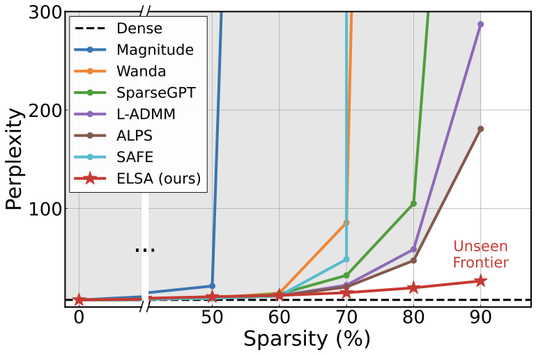
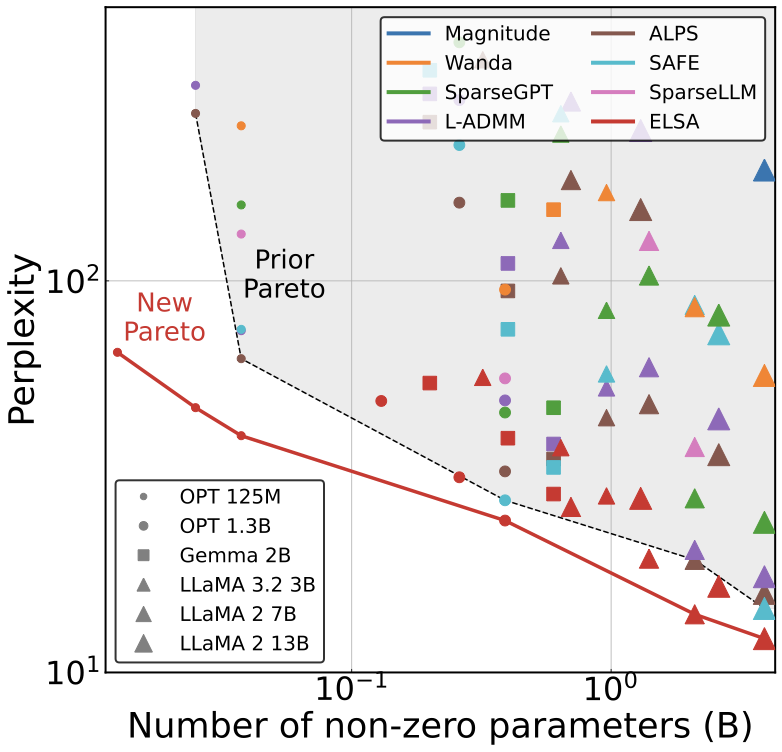

# ❄️👸🏼 ELSA: Extreme LLM Sparsity via surrogate-free ADMM

Official codebase for:

**The Unseen Frontier: Pushing the Limits of LLM Sparsity with Surrogate-Free ADMM ([ICLR '26](https://openreview.net/forum?id=ek6dQSumYx))**  
***Kwanhee Lee**, Hyeondo Jang, Dongyeop Lee, Dan Alistarh, Namhoon Lee*

>ELSA prunes LLMs to extreme sparsity (up to 90%) via surrogate-free constrained optimization with ADMM, without catastrophic collapse.

If you have any questions, please contact: kwanhee.lee@postech.ac.kr


| Sparsity-performance on LLaMA-2 7B | Pareto frontier |
| :---: | :---: |
|  |  |


## Setup

```bash
conda create -n rac python=3.10
conda activate rac
pip install -r requirements.txt
pip install flash-attn==2.8.3 --no-build-isolation
```

> **Note:** The conda environment name used in every script in this repo is `rac` — keep the same name if you want to run the SLURM scripts under `scripts/` unmodified, otherwise update the hardcoded `TORCHRUN=`/`PYTHON=` paths at the top of each script. `requirements.txt` is a full `pip freeze` of the working environment (torch 2.7.1, transformers 4.56.2, vllm 0.10.0, trl 0.21.0, lighteval 0.12.0, flash_attn 2.8.3, Python 3.10.19). It over-specifies (includes everything actually installed, not a minimal set) but is guaranteed to reproduce a working environment.

### Environment variables / secrets

Training and eval scripts expect these to be set (see any script under `scripts/rerun_ot80fw20/` for the exact pattern):

| Variable | Purpose |
|---|---|
| `HF_TOKEN` | HuggingFace token, needed for `--push_to_hub=true` and for downloading gated models. Scripts read it from `~/.hf_token` — put your token in that file, or export it directly. |
| `WANDB_API_KEY` | W&B logging. Scripts `grep` it out of `~/.bashrc` — either add `export WANDB_API_KEY=...` to your `~/.bashrc` or export it directly before running. |
| `HF_HOME` | HuggingFace cache dir (models/datasets). Point this at wherever you want large downloads to land. |
| `HF_DATASETS_OFFLINE` / `TRANSFORMERS_OFFLINE` | Set to `1` once models/datasets are cached locally, to avoid hub lookups during training. Set to `0` when you actually need to download or push. |
| `VLLM_HOST_IP` | Set to `127.0.0.1`. Needed because vLLM's IP auto-detection fails on some cluster nodes. |
| `TOKENIZERS_PARALLELISM` | Set to `false` to silence tokenizer fork warnings under `torchrun`. |
| `PYTORCH_CUDA_ALLOC_CONF` | Set to `expandable_segments:True` — helps avoid fragmentation-driven OOMs during long ADMM runs. |

On a SLURM cluster, also set `--output`/local scratch paths (`/local-data/...` in the example scripts) to wherever your cluster's fast node-local storage lives, and adjust `--exclude=` node lists (those are specific to this cluster's known-bad nodes, not portable).


## Running ELSA

### Single GPU

```bash
python main.py \
    --model="meta-llama/Llama-2-7b-hf" \
    --sparsity_ratio=0.5 \
    --sparsity_type="unstructured" \
    --steps=4096 \
    --admm_batch_size=2 \
    --admm_gradient_accumulation_steps=4 \
    --lr=2e-4 \
    --admm_lmda=0.01 \
    --admm_interval=32 \
    --eval_zero_shot=True \
    --seed=0
```

### Multi-GPU (FSDP)

Configure accelerate for FSDP first (example configs are in `/config`):
```bash
accelerate config
```

Then launch:
```bash
accelerate launch --config_file config/default.yaml main.py \
    --model="meta-llama/Llama-2-7b-hf" \
    --sparsity_ratio=0.5 \
    --steps=4096 \
    --admm_batch_size=2 \
    --admm_gradient_accumulation_steps=4 \
    --lr=2e-4 \
    --admm_lmda=0.01 \
    --admm_interval=32 \
    --eval_zero_shot=True \
    --seed=0
```


## Key Arguments

#### Model & Data
| Argument | Default | Description |
|---|---|---|
| `--model` | `facebook/opt-125m` | HuggingFace model path (or directly to model snapshot) |
| `--seqlen` | `2048` | Sequence length |
| `--dataset` | `c4` | Calibration dataset (`c4`, `wikitext2`) |
| `--data_path` | `None` | Path to local dataset snapshot |
| `--seed` | `0` | Random seed |

#### Sparsity
| Argument | Default | Description |
|---|---|---|
| `--sparsity_ratio` | `0.6` | Target sparsity (e.g. `0.5`, `0.7`) |
| `--sparsity_type` | `unstructured` | Pattern: `unstructured`, `2:4`, `4:8` (fix ratio to `0.5` for 2:4/4:8) |

#### ADMM Training
| Argument | Default | Description |
|---|---|---|
| `--steps` | `10` | Total training steps (overrides `--admm_epochs` if > 0) |
| `--lr` | `2e-4` | Learning rate |
| `--admm_batch_size` | `2` | Per-device batch size |
| `--admm_gradient_accumulation_steps` | `1` | Gradient accumulation steps |
| `--admm_lmda` | `0.01` | Penalty parameter λ (constant schedule) |
| `--admm_init_lmda` / `--admm_final_lmda` | `0.0` / `0.01` | λ schedule endpoints |
| `--admm_lmda_schedule_mode` | `constant` | λ schedule: `constant`, `linear`, `cosine`, `exponential` |
| `--admm_interval` | `2` | Steps between projection (z) and dual (u) updates |
| `--admm_base_optimizer` | `adam` | Base optimizer: `adam`, `adamw`, `adam8bit`, `adam4bit`, `sgd` |
| `--admm_precision` | `bf16` | Training precision: `fp32`, `fp16`, `bf16` |
| `--admm_projection_mode` | `identity` | Importance weighting for projection: `identity`, `momentum`. Use `momentum` for objective-aware projection. |

#### Memory / Dtype
| Argument | Default | Description |
|---|---|---|
| `--admm_dual_dtype` | `fp32` | Dual variable (u) dtype: `fp32`, `bf16`, `float8_e4m3fn`, `float8_e5m2` |
| `--admm_split_dtype` | `fp32` | Split variable (z) dtype: `fp32`, `bf16`, `float8_e4m3fn`, `float8_e5m2` |

#### Output & Evaluation
| Argument | Default | Description |
|---|---|---|
| `--eval_zero_shot` | `True` | Run zero-shot evaluation after pruning |
| `--save_model` | `False` | Save the pruned model |
| `--admm_save_path` | `None` | Directory to save the pruned model |
| `--wandb` | `False` | Enable W&B logging |

## Knowledge Distillation during ADMM

`main.py` supports mixing a dense-teacher KD loss into ADMM training via `lib/gkd_admm.py` / `lib/gkd_admm_trainer.py`:

| Argument | Default | Description |
|---|---|---|
| `--do_offpolicy_kd_admm` | `False` | Dataset-CoT KD: KL(student \|\| teacher) computed on the same input batch (teacher forward pass only, no generation, no vLLM). This is the one to use for standard KD. |
| `--do_kd_admm` | `False` | On-policy KD (student generates its own rollout via vLLM, then distills against the teacher on that rollout). Different code path — don't confuse the two flags. |
| `--kd_lambda` / `--kd_ntp_lambda` | `0.0` / `0.0` | Loss mix: `loss = kd_lambda * KD + kd_ntp_lambda * NTP` (offpolicy path ignores `kd_ntp_lambda` — it's KD-only regardless). |
| `--kd_topk` | `50` | Restrict KD's KL divergence to the top-K vocab logits (student's own top-K for reverse KL). **Set to `0` for full-vocab KL** — the top-K path gathers logits from an already-full-vocab `log_softmax` without renormalizing over the truncated support, so the reported loss can go negative and isn't a proper divergence. Full vocab is mathematically correct and isn't meaningfully more expensive (the model's forward pass already materializes full-vocab logits either way). |
| `--kd_temperature` | `1.0` | Softmax temperature for the KD loss. |

Example (single GPU, dataset-CoT KD mixed 50/50 with NTP):
```bash
python main.py \
    --model="Qwen/Qwen3-1.7B" \
    --dataset=mixed_cot --data_path=<path/to/mixed_cot.jsonl> \
    --sparsity_ratio=0.5 --steps=2048 \
    --do_offpolicy_kd_admm=true --kd_lambda=0.5 --kd_ntp_lambda=0.5 --kd_topk=0 \
    --save_model=true --push_to_hub=true
```

## TR-GMP: Trust-Region Gradual Magnitude Pruning (current active experiments)

The actively-running experiments (`scripts/slurm_gmp_tr_*.sh`) use a different pruning loop than plain ELSA ADMM above: **TR-GMP** grows the mask gradually during training instead of solving an ADMM projection. It supports N:M structured sparsity, on-policy KD (OPKD) via a vLLM rollout pool, and an optional PCG reconstruction correction after each mask update.

```bash
python main.py \
    --model="Qwen/Qwen3-1.7B" \
    --dataset=mixed_cot --data_path=data/ot3_fineweb_200k_qwen3_train.jsonl \
    --sparsity_ratio=0.5 \
    --sparsity_type=unstructured \
    --do_gmp=true \
    --steps=2048 \
    --gmp_batch_size=1 --gmp_grad_accum=8 --lr=1e-4 \
    --gmp_warmup_ratio=0.05 --gmp_mask_interval=32 \
    --gmp_fisher_beta=0.999 --gmp_saliency=fisher \
    --seqlen=2048 --gmp_max_prompt_len=512 \
    --gmp_kd_only=false --gmp_ntp_lambda=0.33 --gmp_kd_lambda=0.33 \
    --gmp_onpolicy_kd_lambda=0.33 --gmp_onpolicy_max_new_tokens=256 \
    --gmp_prompt_path=data/ot3_fineweb_200k_qwen3_opdprompts.jsonl \
    --gmp_tr_enabled=true --gmp_tr_delta_init=0.05 --gmp_tr_delta_min=0.001 \
    --gmp_tr_kl_threshold=0.01 --gmp_tr_kl_reduce=mean \
    --gmp_save_path=models/ --save_model=true --push_to_hub=true \
    --eval_zero_shot=true --eval_full_bench=true \
    --wandb=true --wandb_project=reasoning_qwen3_1.7b
```

The working reference launchers for this exact recipe (and its variants) live directly under `scripts/`, not `scripts/rerun_ot80fw20/`:

| Script | Recipe |
|---|---|
| `scripts/slurm_gmp_tr_ntpkd_opkd_qwen3_1.7b.sh` | NTP+KD+OPKD (0.33/0.33/0.33), no PCG |
| `scripts/slurm_gmp_tr_kd_opkd_pcg_qwen3_1.7b.sh` | KD+OPKD only (`--gmp_kd_only=true`) + PCG |
| `scripts/slurm_gmp_tr_ntpkd_opkd_pcg_qwen3_1.7b.sh` | NTP+KD+OPKD + PCG (accepts a 5th arg for sequential-PCG mode) |
| `scripts/slurm_gmp_tr_ntpkd_qwen3_4b.sh` | 4B NTP+KD, no OPD, single GPU (needs H200 — see comment in script) |
| `scripts/slurm_gmp_tr_ntpkd_qwen3_4b_fsdp2gpu.sh` | Same, but 2xA100-80GB FSDP (works around the H200-only OOM) |

Usage pattern for all of them: `sbatch <script> <SPARSITY> <KL_THRESHOLD> [OPD_GEN_LEN] [PCG_MAXITER] [PCG_SEQUENTIAL]`, e.g. `sbatch scripts/slurm_gmp_tr_ntpkd_opkd_pcg_qwen3_1.7b.sh 0.5 0.01 256 5 true`.

### Key TR-GMP flags

| Flag | Default | Description |
|---|---|---|
| `--do_gmp` | `False` | Enable TR-GMP / GMP training loop instead of ADMM. |
| `--sparsity_type` | `unstructured` | `unstructured`, `2:4`, `4:8`. N:M mode uses a global-threshold search with a per-block cap (`prune_m - prune_n`) so no block is ever over-pruned. |
| `--gmp_tr_enabled` | `False` | Use trust-region KL-constrained mask growth instead of a fixed cubic/cosine sparsity ramp. |
| `--gmp_tr_kl_threshold` | `0.01` | Max per-token KL(old‖candidate) allowed to accept a mask update (line-searched via `gmp_tr_delta_init`/`gmp_tr_delta_min`). |
| `--gmp_mask_interval` | `32` | Steps between mask updates. |
| `--gmp_ntp_lambda` / `--gmp_kd_lambda` / `--gmp_onpolicy_kd_lambda` | `1.0` / `0.0` / `0.0` | Loss mix: NTP (CoT tokens) + dataset-CoT KD (dense teacher, no generation) + on-policy KD (student rollout vs. dense teacher, via vLLM). All three together (e.g. 0.33 each) is the current recipe — NTP-only ablations were found to cap the achievable ceiling. |
| `--gmp_kd_only` | `False` | Zero out NTP loss, KD+OPKD only. |
| `--gmp_prompt_path` | `data_path` | Prompts JSONL used to seed the OPKD rollout pool (`gmp_onpolicy_kd_lambda > 0`). The pool is refilled from live vLLM rollouts at every `gmp_mask_interval`, both pre- and post-mask-update, for FSDP and non-FSDP alike — don't reuse a stale pool checkpoint. |
| `--gmp_pcg_correct` | `False` | After each mask update, backsolve surviving weights toward the dense teacher's output via a masked conjugate-gradient correction (ALPS-style). Non-FSDP only, stops once the mask is frozen (TR reached target sparsity). |
| `--gmp_pcg_maxiter` | `5` | CG iterations per layer per correction. |
| `--gmp_pcg_damp` | `0.01` | Ridge damping (relative to mean diag of X^TX). |
| `--gmp_pcg_sequential` | `False` | ALPS-style sequential per-layer correction (re-forward with corrected weights before capturing the next layer's input) instead of one single-snapshot forward. Costs ~num_layers extra forwards per mask update; use for higher-fidelity correction when layer-order effects matter. |
| `--admm_dynamic_barrier` | `False` | (Plain-ADMM path only, not TR-GMP.) Replace the fixed/scheduled ADMM λ with a per-step Dynamic Barrier coefficient (`admm_barrier_alpha`/`admm_barrier_beta`/`admm_barrier_lambda_max` tune it). |

## Standalone Evaluation

Training scripts can (and, on multi-GPU/FSDP setups, should) skip evaluation entirely (`--eval_zero_shot=false --eval_full_bench=false`) and push the checkpoint to HF Hub; `scripts/eval_full.py` then re-evaluates it as a separate single-GPU job:

```bash
python scripts/eval_full.py \
    --model_path <local path or HF repo id> \
    --wandb_project <project> --wandb_run_id <existing run id to resume/append> \
    --method elsa --sparsity 0.5 \
    --tp_size 1 --gpu_util 0.85 \
    [--skip_ppl] [--skip_zeroshot] [--skip_lighteval]
```

This separation matters on multi-GPU FSDP jobs specifically: sharding the 9 zero-shot tasks across ranks (`i % world_size == rank`) causes idle ranks to sit in `dist.all_gather_object` far longer than NCCL's ~2h watchdog timeout when task costs are wildly uneven (hellaswag/race have 10-40x more requests than boolq/rte) — this crashed multiple multi-day training runs during the eval phase in past runs. Doing zero-shot/reasoning eval in a separate, single-GPU job sidesteps that class of bug entirely.

## Reference SLURM Scripts

`scripts/rerun_ot80fw20/` has working, battle-tested SLURM scripts for training + eval on this cluster (SparseGPT/ALPS/SparseLLM baselines, ELSA plain, ELSA+KD, dependency-chained train→eval). They're the best starting point for adapting to a new cluster — copy one, swap the partition/QOS/exclude list/local-scratch paths for your cluster, and the `--model`/`--data_path`/hyperparameter flags stay the same.

`scripts/build_ot3_fineweb_dataset.py` builds the mixed OpenThoughts3-CoT (80%) + FineWeb-Edu (20%) pretraining dataset (`ot3_fineweb_200k_qwen3.jsonl`) used by the `mixed_cot` dataset loader in these scripts.

---

## Inference Acceleration \& Memory Savings
We utilize recent SpMV framework [MACKO](https://github.com/vlejd/macko_spmv) to obtain real-world benefits. 

Please specify `admm_save_path` to save the results. After saving the results with ELSA, follow the instructions in [End2EndModelInference](https://github.com/vlejd/macko_spmv/blob/master/TECHNICAL_README.md) to obtain acceleratable sparse models!

## Acknowledgements \& Citation
This codebase was built upon [SparseGPT](https://github.com/IST-DASLab/sparsegpt/tree/master), [Wanda](https://github.com/locuslab/wanda).

If you find our work useful, please cite! 

```bibtex
@inproceedings{
    lee2026the,
    title={The Unseen Frontier: Pushing the Limits of {LLM} Sparsity with Surrogate-Free {ADMM}},
    author={Kwanhee Lee and Hyeondo Jang and Dongyeop Lee and Dan Alistarh and Namhoon Lee},
    booktitle={The Fourteenth International Conference on Learning Representations},
    year={2026},
    url={https://openreview.net/forum?id=ek6dQSumYx}
}
```
